# 📘 PawMate — Documentación Técnica

> Plataforma móvil + web para conectar dueños de mascotas con cuidadores verificados.
> Versión: 1.0 · Última revisión: 2026-04

---

## 📑 Índice

1. [Visión general](#1-visión-general)
2. [Arquitectura del sistema](#2-arquitectura-del-sistema)
3. [Stack tecnológico](#3-stack-tecnológico)
4. [Modelo de datos](#4-modelo-de-datos)
5. [Flujos clave](#5-flujos-clave)
6. [Módulos](#6-módulos)
7. [Seguridad](#7-seguridad)
8. [Despliegue](#8-despliegue)
9. [Variables de entorno](#9-variables-de-entorno)
10. [Issues conocidos](#10-issues-conocidos)

---

## 1. Visión general

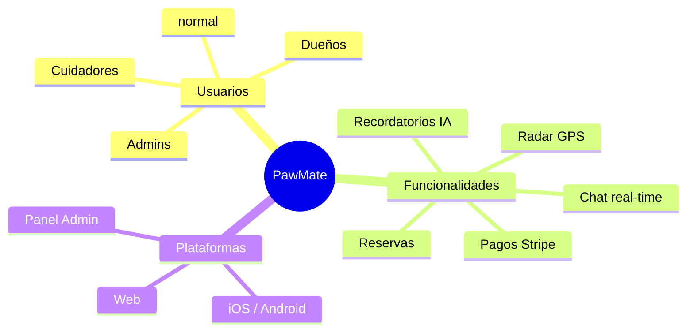

**Propósito:** Resolver la falta de confianza al dejar a tu mascota con un cuidador desconocido, mediante verificación de identidad, pagos seguros, geolocalización en tiempo real y sistema de reseñas.


| Característica   | Valor                                         |
| ----------------- | --------------------------------------------- |
| Usuarios objetivo | Dueños de mascotas + cuidadores particulares |
| Mercado           | España (escalable)                           |
| Modelo de negocio | Comisión por reserva (Stripe)                |
| Modalidades       | Paseo · Hotel ·                             |

---

## 2. Arquitectura del sistema

### Diagrama de alto nivel

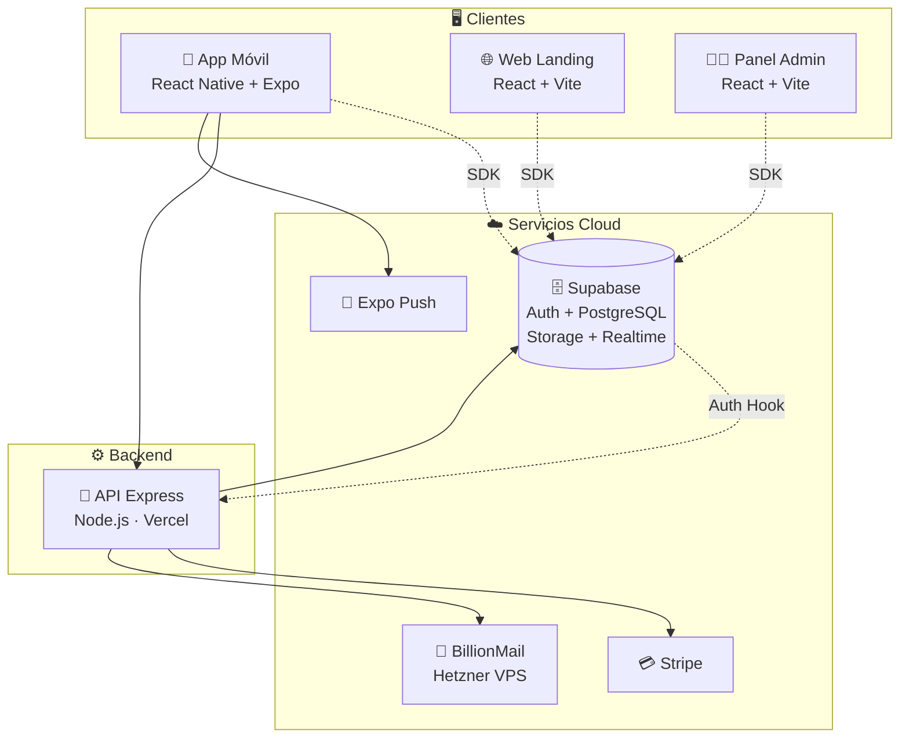

### Por qué esta arquitectura


| Decisión                                | Motivo                                                                          |
| ---------------------------------------- | ------------------------------------------------------------------------------- |
| **Supabase como backend principal**      | Auth + DB + Storage + Realtime en uno. Reduce complejidad y coste.              |
| **Express solo para tareas server-side** | Emails, pagos Stripe, lógica que requiere service-key (no exponer al cliente). |
| **Cliente directo a Supabase**           | Latencia mínima, RLS protege los datos a nivel de fila.                        |
| **BillionMail self-hosted**              | Control total del envío, sin coste por email, sin límites de proveedor.       |

---

## 3. Stack tecnológico

### Móvil

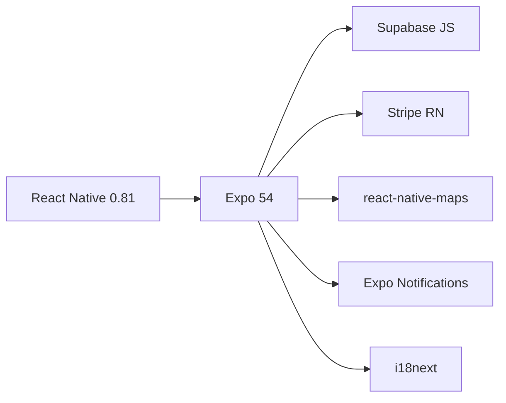

### Web / Admin

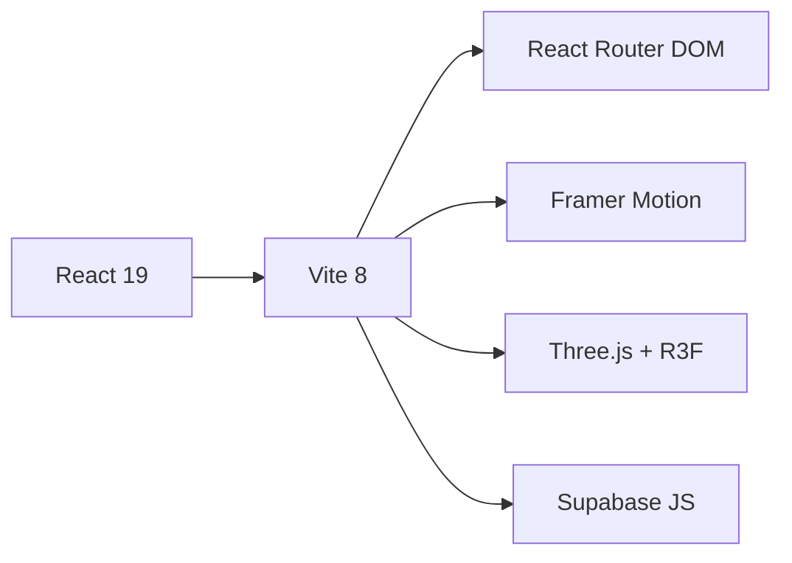

### Server

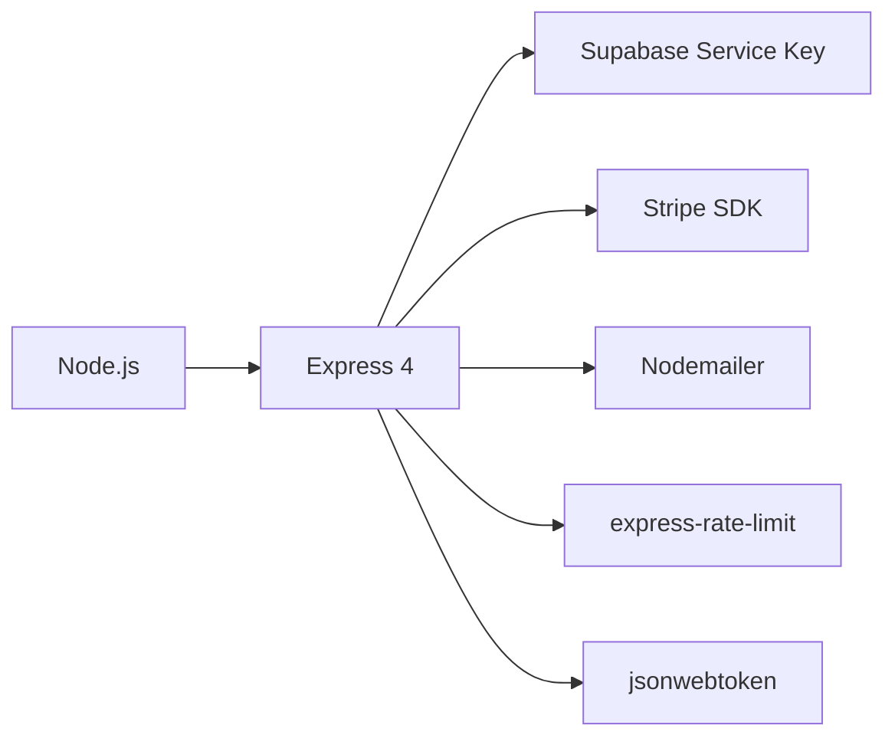

### Resumen tabular


| Capa                | Tecnologías                                       |
| ------------------- | -------------------------------------------------- |
| **Frontend móvil** | React Native, Expo, Stripe RN, Maps, Notifications |
| **Frontend web**    | React, Vite, Framer Motion, Three.js               |
| **Backend**         | Express, Node.js                                   |
| **Base de datos**   | Supabase (PostgreSQL)                              |
| **Auth**            | Supabase Auth (JWT + PKCE)                         |
| **Storage**         | Supabase Storage Buckets                           |
| **Realtime**        | Supabase Realtime (WebSockets)                     |
| **Pagos**           | Stripe Connect                                     |
| **Email**           | BillionMail SMTP (Hetzner)                         |
| **Push**            | Expo Push API                                      |
| **i18n**            | i18next (ES + EN)                                  |
| **DNS**             | Namecheap                                          |
| **Hosting**         | Vercel (web/admin/server) + Hetzner (mail)         |

---

## 4. Modelo de datos

### Diagrama Entidad-Relación

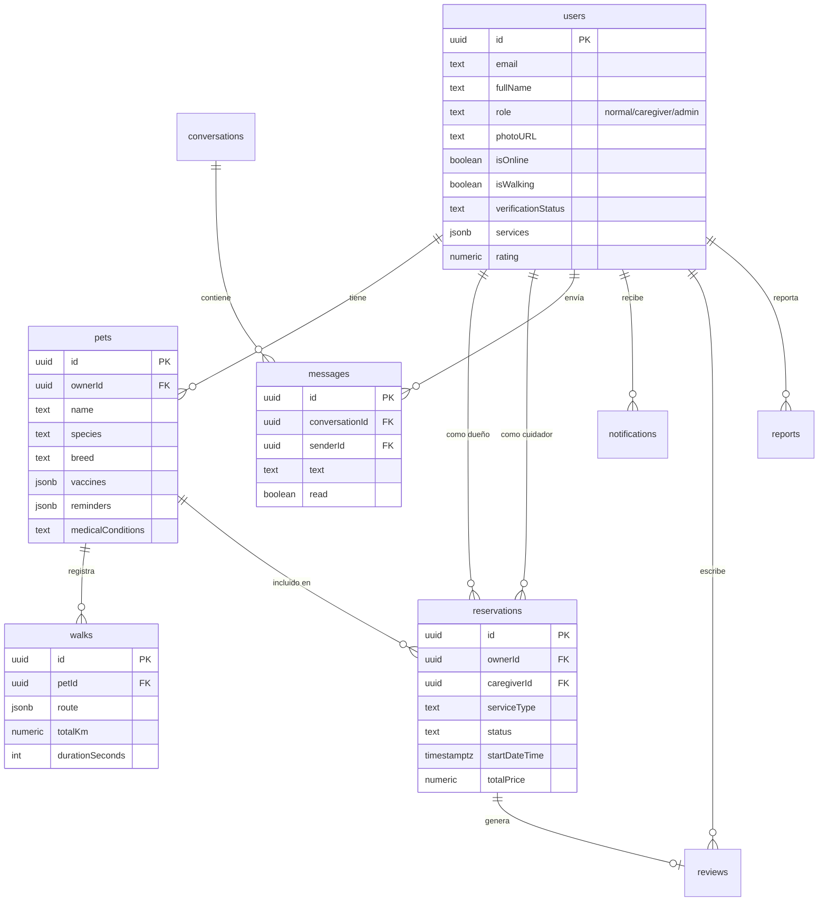

### Tablas principales (resumen)


| Tabla                        | Filas estimadas    | Propósito                    |
| ---------------------------- | ------------------ | ----------------------------- |
| `users`                      | Todos los usuarios | Perfil + rol + datos cuidador |
| `pets`                       | Una por mascota    | Ficha completa de la mascota  |
| `reservations`               | Por reserva        | Bookings con estado           |
| `walks`                      | Por paseo          | Tracking GPS                  |
| `conversations` + `messages` | Chat               | 1:1 mensajería realtime      |
| `notifications`              | Por evento         | Notificaciones in-app         |
| `reviews`                    | Tras reserva       | Reseñas a cuidadores         |
| `reports`                    | Reportes           | Bug reports + denuncias       |
| `system_logs`                | Auditoría         | Trazabilidad de acciones      |

> Esquema completo SQL en [supabase_schema.sql](supabase_schema.sql)

### Storage Buckets


| Bucket    | Contenido                                                                         |
| --------- | --------------------------------------------------------------------------------- |
| `pawmate` | Fotos mascotas, documentos verificación, imágenes reportes, galería cuidadores |
| `avatars` | Fotos perfil de usuarios                                                          |

---

## 5. Flujos clave

### 5.1 Registro y verificación

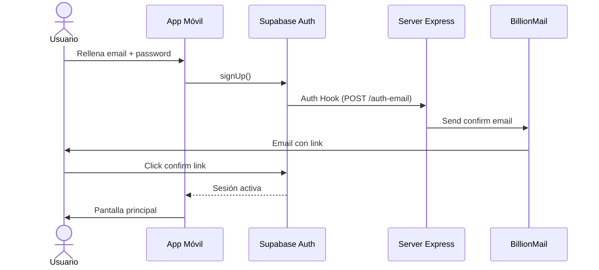

### 5.2 Reserva y pago

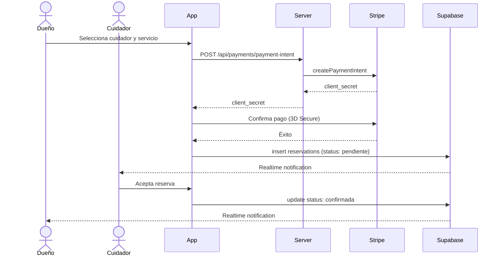

### 5.3 Paseo en tiempo real

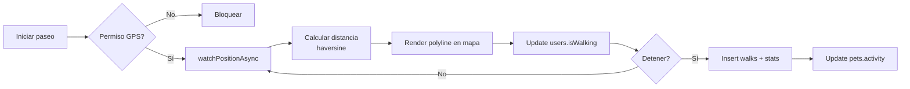

### 5.4 Recordatorios inteligentes (nuevo)

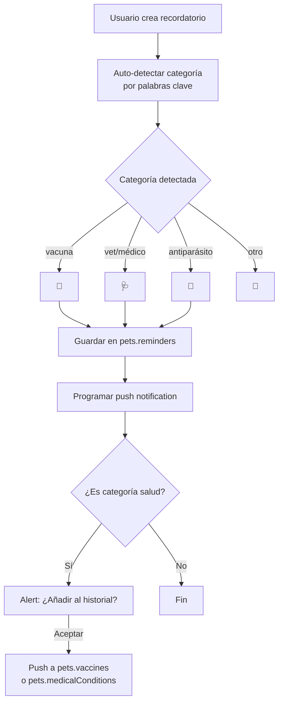

### 5.5 Chat en tiempo real

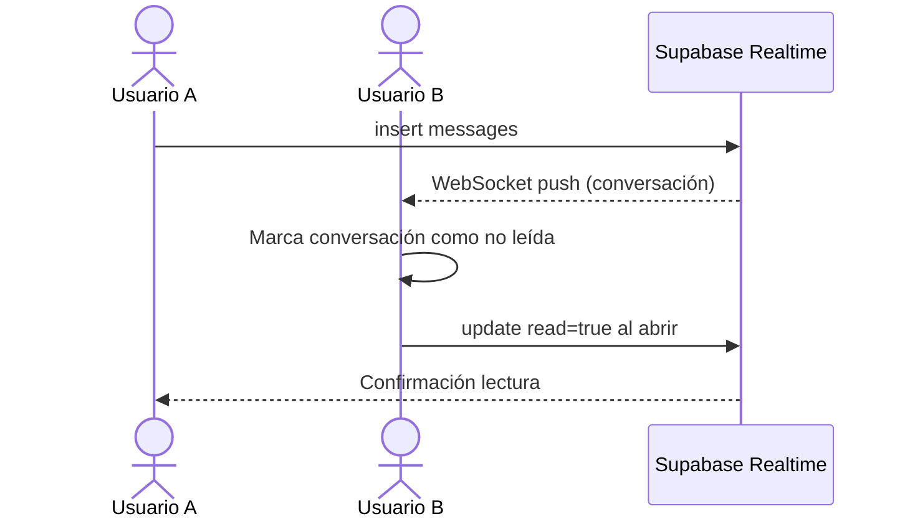

---

## 6. Módulos

### 6.1 Mobile (`mobile/`)

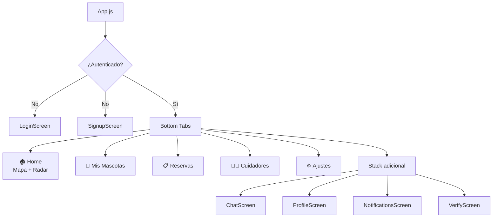

**Pantallas clave:**


| Pantalla            | Función principal                                  |
| ------------------- | --------------------------------------------------- |
| `HomeScreen`        | Mapa con radar de cuidadores online + iniciar paseo |
| `MyPetsScreen`      | CRUD mascotas + recordatorios + vacunas + walks     |
| `BookingScreen`     | Lista reservas + chat por reserva + check-in QR     |
| `CaregiversScreen`  | Buscar cuidadores con filtros                       |
| `ChatScreen`        | Mensajería 1:1 realtime                            |
| `VerifyOwnerScreen` | Subida DNI + selfie para verificación              |

### 6.2 Server (`server/`)

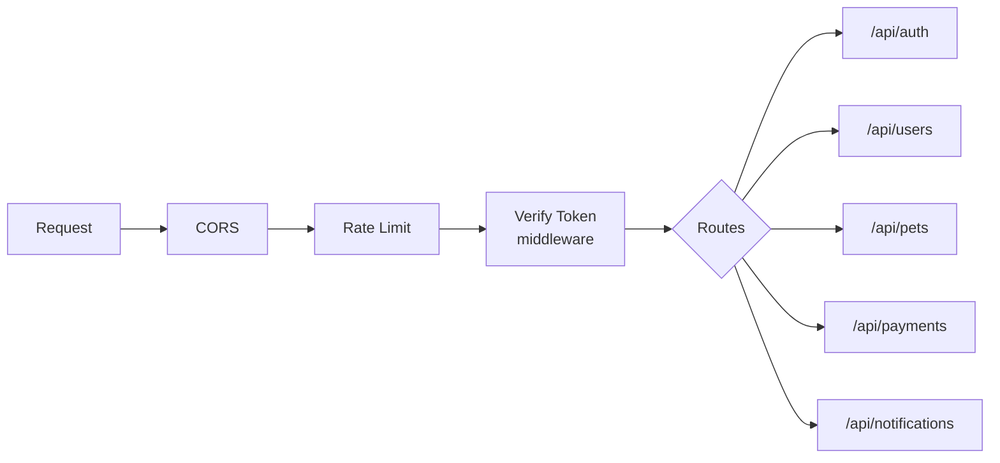

**Endpoints:**


| Método             | Ruta                                    | Descripción                   |
| ------------------- | --------------------------------------- | ------------------------------ |
| POST                | `/api/auth/verify-token`                | Verifica JWT de Supabase       |
| GET                 | `/api/auth/profile`                     | Perfil propio                  |
| GET/PUT/DELETE      | `/api/users/:id`                        | CRUD usuario (self/admin)      |
| GET/POST/PUT/DELETE | `/api/pets/:id`                         | CRUD mascotas                  |
| POST                | `/api/payments/payment-intent`          | Crear PaymentIntent Stripe     |
| POST                | `/api/payments/refund`                  | Reembolso                      |
| POST                | `/api/payments/webhook`                 | Webhook Stripe                 |
| POST                | `/api/notifications/welcome-email`      | Email bienvenida               |
| POST                | `/api/notifications/reservation-status` | Email cambio estado reserva    |
| POST                | `/api/notifications/auth-email`         | Hook Supabase para emails auth |

### 6.3 Admin (`admin/`)

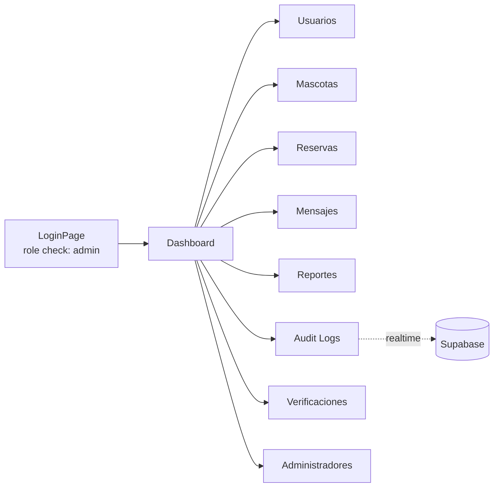

**Funcionalidades:**

- Estadísticas en tiempo real (KPIs)
- Aprobar/rechazar verificaciones de cuidadores
- Banear/desbanear usuarios
- Ver chats entre usuarios (moderación)
- Audit log de todas las acciones del sistema
- Gestionar reportes de bugs/denuncias

### 6.4 Web (`web/`)

Landing page de marketing con secciones animadas.


| Sección     | Animación                                  |
| ------------ | ------------------------------------------- |
| Hero         | 3D objects (Three.js) + texto rotativo      |
| Trust band   | Marquee infinito de logos                   |
| Features     | Cards con hover effects                     |
| Showcase     | Mockups de la app                           |
| Stats        | Contadores animados (intersection observer) |
| Testimonials | Carrusel de reseñas                        |
| CTA          | Botones App Store + Google Play             |

---

## 7. Seguridad

### Arquitectura de seguridad

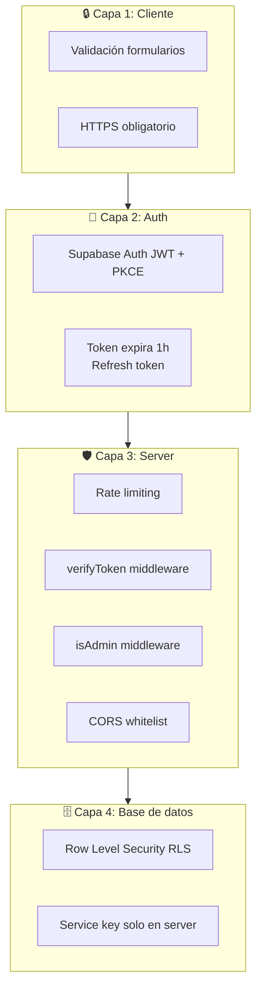

### Medidas implementadas


| Medida                | Implementación                                                |
| --------------------- | -------------------------------------------------------------- |
| **Autenticación**    | Supabase Auth con email/password + Magic Link + OAuth Google   |
| **Autorización**     | Roles`normal` / `caregiver` / `admin` con middleware `isAdmin` |
| **Tokens**            | JWT firmados, expiran en 1h, refresh automático               |
| **Hashing**           | bcrypt (gestionado por Supabase Auth)                          |
| **HTTPS**             | Forzado en Vercel + Let's Encrypt en BillionMail               |
| **CORS**              | Whitelist configurada en server                                |
| **Rate limiting**     | express-rate-limit en endpoints públicos                      |
| **Email auth hook**   | JWT firmado con`SUPABASE_AUTH_HOOK_SECRET`                     |
| **Service key**       | Solo en server, nunca expuesta al cliente                      |
| **Auto-eliminación** | Endpoint DELETE protegido (self o admin)                       |
| **Ban detection**     | Realtime listener cierra sesión al banear                     |
| **DKIM/SPF/DMARC**    | Configurados en Namecheap para anti-phishing                   |

### Privacidad

- DNI/selfies guardados en Supabase Storage privado.
- Endpoint `/auth/profile` filtra campos sensibles (`idFrontUrl`, `idBackUrl`, `selfieUrl`, `expoPushToken`).
- IBAN encriptado pendiente (issue conocido).
- GDPR: usuario puede auto-eliminar cuenta + datos.

---

## 8. Despliegue

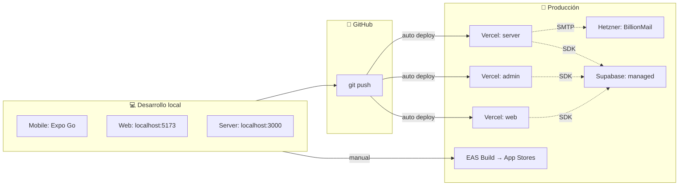

### Tabla de despliegue


| Componente    | Plataforma     | URL                  |
| ------------- | -------------- | -------------------- |
| Web landing   | Vercel         | apppawmate.com       |
| Admin         | Vercel         | admin.apppawmate.com |
| Server API    | Vercel         | api.apppawmate.com   |
| App iOS       | App Store      | (pendiente)          |
| App Android   | Google Play    | (pendiente)          |
| Email server  | Hetzner VPS    | mail.apppawmate.com  |
| Base de datos | Supabase Cloud | xxxx.supabase.co     |

---

## 9. Variables de entorno

### Mobile (`mobile/.env`)

```ini
EXPO_PUBLIC_SUPABASE_URL=
EXPO_PUBLIC_SUPABASE_ANON_KEY=
EXPO_PUBLIC_STRIPE_PUBLISHABLE_KEY=
EXPO_PUBLIC_API_URL=
```

### Server (`server/.env`)

```ini
PORT=3000
SUPABASE_URL=
SUPABASE_SERVICE_KEY=
STRIPE_SECRET_KEY=
STRIPE_WEBHOOK_SECRET=
SMTP_HOST=mail.apppawmate.com
SMTP_PORT=587
SMTP_USER=noreply@apppawmate.com
SMTP_PASS=
SMTP_FROM=noreply@apppawmate.com
SUPABASE_AUTH_HOOK_SECRET=
ALLOWED_ORIGINS=https://apppawmate.com,https://admin.apppawmate.com
```

### Admin / Web (`.env`)

```ini
VITE_SUPABASE_URL=
VITE_SUPABASE_ANON_KEY=
```

---

## 10. Issues conocidos

> Lista priorizada de mejoras pendientes.

### 🔴 Críticos


| # | Problema                                  | Solución propuesta                         |
| - | ----------------------------------------- | ------------------------------------------- |
| 1 | RLS policies =`USING (true)`              | Reescribir policies por tabla con ownership |
| 2 | `updateUser` permite cambiar `role`       | Whitelist de campos editables               |
| 3 | API keys hardcodeadas (Weather)            | Mover a variables de entorno                |

### 🟠 Altos


| # | Problema                                 | Solución                                      |
| - | ---------------------------------------- | ---------------------------------------------- |
| 4 | Email endpoints sin rate limit estricto  | Aplicar 10 emails/hora/IP                      |
| 5 | IBAN en plaintext                        | Encriptar con KMS                              |
| 6 | Sin índices en`ownerId`, `status`       | `CREATE INDEX` en schema                       |
| 7 | Vercel bloquea SMTP outbound (plan free) | Migrar server a Render/Railway o usar plan Pro |

### 🟡 Medios


| #  | Problema                                                          | Solución                               |
| -- | ----------------------------------------------------------------- | --------------------------------------- |
| 8  | Lógica paseos duplicada en Home + MyPets                         | Extraer a hook`useWalkTracking()`       |
| 9  | N+1 queries en Admin PetsPage                                     | Join con`select(..., owner:users(...))` |
| 10 | Columnas duplicadas (`birthdate`/`birthDate`, `image`/`photoURL`) | Unificar a una sola                     |

### 🟢 Bajos

- `Math.random()` como key en LogsPage


*PawMate © 2026 · Documentación técnica v1.0*
